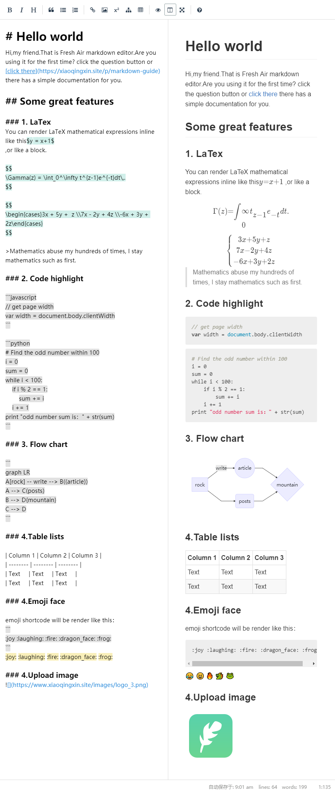
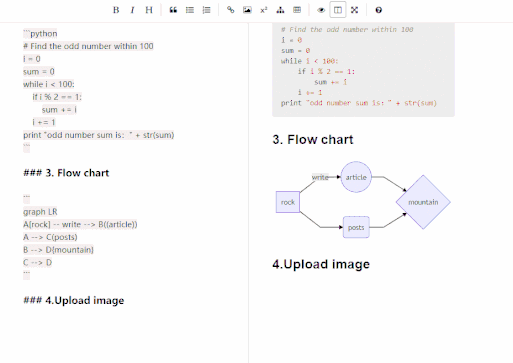

# Laravel-smartmd


<p align="center">
 <a href="./docs_EN.md">Documentation</a> | <a href="./docs_CN.md">中文文档</a>
</p>

<p align="center">
<a href="https://travis-ci.org/NoisyWinds/laravel-smartmd"></a>
<a href="LICENSE"></img></a>
<a href="https://laravel.com"></img></a>
<a href="https://packagist.org/packages/noisywinds/laravel-smartmd"></img></a>
</p>

A simple markdown editor compatible most markdown parse,You can choose any parse methods on server or client,like Mathematical formula、flowchart、upload image...
this program is a plugin for laravel 5.4 and php 7.1 upper.more feature develop now...  

  
## screenshot
editor demo page：[Demo](https://xiaoqingxin.site/editor/write)   
js parser page： [Demo](https://xiaoqingxin.site/editor/js-show)  
php parser page： [Demo](https://xiaoqingxin.site/editor/php-show)
  
  
  --- 
   
  ---
  
  
Reference:
- CodeMirror [link](https://github.com/codemirror/CodeMirror) 
- Simplemde-markdown [link](https://github.com/sparksuite/simplemde-markdown-editor)
- markdown-it (markdown render) [link](https://github.com/markdown-it/markdown-it)
- mermaid (flowchart) [link](https://github.com/knsv/mermaid)
- intervention (image handling) [link](https://github.com/Intervention/image)

## environment
- PHP >= 7.1.0
- Laravel >= 5.4.0

## How to use
Install：
```
composer require noisywinds/laravel-smartmd
```
Initialization:
```
php artisan vendor:publish --provider="NoisyWinds\Smartmd\SmartmdServiceProvider"
```
Write route in web.php :
```
Route::group(['namespace' => 'Smartmd', 'prefix' => 'editor'], function () {
    Route::post('/upload', 'UploadController@imSave');
    Route::get('/write', function () {
        return view('vendor/smartmd/write');
    });
    Route::get('/php-show','ParseController@index');
    Route::get('/js-show',function(){
        return view('vendor/smartmd/js-show');
    });
});
```
rewrite UploadController or config/smartmd.php change your image upload place:
```php
<?php
return [
    "image" => [
        /*
         * like filesystem, Where do you like to place pictures?
         */
        "root" => storage_path('app/public/images'),
        /*
         * return public image path
         */
        "url" => env('APP_URL').'/storage/images',
    ],
];
```

## shortcut keys
1. Bold (Ctrl + b)
2. Italic (Ctrl + I)
3. Insert Image (Ctrl + Alt + I)
4. Insert Math (Ctrl + m)
5. Insert flowchart (Ctrl + Alt + m)
6. more... (mac command the same with ctrl)


## client initialization
```javascript
  new Smartmd({
    el: "#editor",
    height: "80vh",
    autoSave: {
      uuid: 1,
      delay: 5000
    },
    isFullScreen: true,
    isPreviewActive: true,
    uploads: {
      url: './upload',
      type: ['jpeg', 'png', 'bmp', 'gif', 'jpg'],
      maxSize: 4096,
      typeError: 'Image support format {type}.',
      sizeError: 'Image size is more than {maxSize} kb.',
      serverError: 'Upload failed in {msg}'
    }
  });
```

## parse markdown 
#### parse by javascript (without sever):
```html
// require in your view meta
@include('Smartmd::js-parse')
```
```
<script>
    // create Parsemd object use javascript parse markdown
    var parse = new Parsemd();
    var html = parse.render(document.getElementById("editor").value.replace(/^\s+|\s+$/g, ''));
    document.getElementById("content").innerHTML = html;
</script>
```
#### need editor and parse by javascript:
```html
<script>
    var smartmd = new Smartmd({
        el: "#editor"
    });
    smartmd.markdown("# hello world");
</script>
```
#### php parse:
```html
// require in your view meta
@include('Smartmd::php-parse')
```
ParseController.php
```
use NoisyWinds\Smartmd\Markdown;

$parse = new Markdown();
$text = "# Your markdown text";
$html = $parse->text($text);
return view('Smartmd::php-show',['content'=>$html]);

```

## How to extand
#### 1. editor
 Smartmd.js  [noisywinds/smartmd](https://github.com/noisywinds/smartmd) 
#### 2. markdown text parse
use markdown-it plugin [link](https://github.com/markdown-it/markdown-it)

